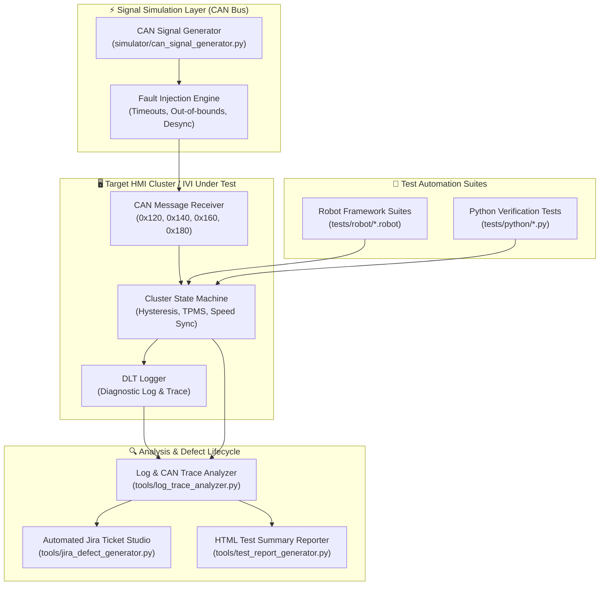

# 🚗 Automotive HMI & IVI Automated Testing & Signal Simulation Framework

[](https://sudeepthirao694-hub.github.io/automotive-hmi-test-framework/)

[](https://github.com/sudeepthirao694-hub/automotive-hmi-test-framework/actions/workflows/hmi-ci-pipeline.yml)
[](https://opensource.org/licenses/MIT)
[](#)
[](#)

> 🌐 **Interactive Web Portal:** [https://sudeepthirao694-hub.github.io/automotive-hmi-test-framework/](https://sudeepthirao694-hub.github.io/automotive-hmi-test-framework/)  
> Includes the **Visual Defect Spotter**, **Live Snowflake & Hysteresis Simulator**, **Top 10 Interview Q&A Flashcards**, and **Automotive Jira Ticket Studio**.

Enterprise test automation and signal simulation framework designed specifically for **Automotive Instrument Cluster HMI and In-Vehicle Infotainment (IVI)** verification.

Built to mirror Tier-1 / OEM automotive test environments (Vector CANoe, dSPACE HIL, Qt/QML, Android Automotive OS), providing **automated CAN signal generation**, **Robot Framework test suites**, **boundary value analysis with hysteresis**, **DLT log parsing**, and **automated Jira defect reporting**.

---


---

## 🏗️ Architecture Overview



---

## 📂 Repository Structure

```
automotive-hmi-test-framework/
├── .github/workflows/
│   └── hmi-ci-pipeline.yml          # GitHub Actions CI automated pipeline
├── config/
│   ├── vehicle_can_signals.json     # CAN message matrix & signal definitions
│   └── test_environments.json       # HIL bench & virtual SIL configurations
├── simulator/
│   ├── can_signal_generator.py      # Cyclic CAN bus generator & fault injector
│   ├── cluster_hmi_state_machine.py # Cluster firmware simulation with hysteresis
│   └── dlt_logger.py                # GENIVI/AUTOSAR Diagnostic Log & Trace simulator
├── tests/
│   ├── robot/
│   │   ├── test_temperature_bva.robot   # BVA & Hysteresis for Snowflake freeze warning
│   │   ├── test_tpms_monitoring.robot   # TPMS unit consistency (kPa vs bar)
│   │   ├── test_speedometer_sync.robot  # Digital vs analog needle synchronization
│   │   └── test_cluster_telltales.robot # ISO 2575 lamp test & safety telltales
│   └── python/
│       ├── test_can_timeout_faults.py   # CAN timeout fallback (--.-) & DTC U0100
│       └── test_hmi_logic.py            # Calendar validation (catching 30.02.2021)
├── tools/
│   ├── log_trace_analyzer.py        # CAN trace (.blf/.asc) & DLT log analyzer
│   ├── jira_defect_generator.py     # Automated Jira ticket exporter
│   ├── robot_hmi_library.py         # Custom Robot Framework library bridge
│   └── test_report_generator.py     # ISO 29119 HTML report generator
├── artifacts/
│   ├── sample_can_trace.json        # Example CAN bus trace with injected anomalies
│   └── sample_dlt_log.txt           # Example DLT log file
├── run_tests.js                     # Instant cross-platform test runner (Node.js)
├── run_tests.py                     # Python test execution engine
├── package.json                     # Node.js project descriptor
└── requirements.txt                 # Python / Robot Framework dependencies
```

---

## ⚡ Quickstart

### 1. Instant Run (Zero Setup Required)
Run the cross-platform automation engine directly using Node.js:
```bash
node run_tests.js
```

### 2. Run with Python & Robot Framework
```bash
pip install -r requirements.txt
python run_tests.py
```

To run Robot Framework test suites directly:
```bash
robot --outputdir reports tests/robot/test_temperature_bva.robot
```

---

## 🧪 Validated Core Test Scenarios

### 1. Boundary Value Analysis (BVA) & Hysteresis
Validates outside temperature warning:
* **6.0°C:** Normal warm partition -> Snowflake **OFF**.
* **5.1°C:** Just above boundary -> Snowflake **OFF**.
* **5.0°C:** Exact boundary (< 5.0) -> Snowflake **OFF**.
* **4.9°C:** Just below boundary -> Snowflake **ON**.
* **Hysteresis Band (5.0°C – 5.9°C):** Retains previous state to eliminate telltale flickering caused by sensor noise.
* **Defect Regression:** Catches illegal active snowflake at **+13.0°C**.

### 2. Speedometer Needle vs. Digital Readout Synchronization
* Evaluates UNECE Regulation 39 compliance.
* Catches desynchronization bugs where digital readout indicates `100 MPH` while analog needle lags at `72 MPH`.

### 3. TPMS Multi-Wheel Metric Consistency
* Verifies that all 4 tires strictly display uniform units (`kPa` in Metric mode).
* Identifies out-of-range physical values (e.g. `444 bar` explosion hazard bug).

### 4. CAN Communication Timeout & Graceful Degradation
* Injects loss of CAN bus signal (> 500ms).
* Verifies that the cluster never freezes or crashes, renders fallback notation (`--.- °C`), and registers Diagnostic Trouble Code `U0100`.

---

## 📊 Sample Generated Reports & Defect Tickets

When a failure is detected, the framework automatically produces:

1. **Interactive HTML Test Report:** Complete metrics, execution times, pass/fail status, and an automated **Go / No-Go** release recommendation.
2. **Jira Defect Ticket:** Conforms to Tier-1 OEM standards with structured markdown:
   - Summary: `[Component][Subsystem] Description`
   - Preconditions (Ignition KL15, CAN status)
   - Step-by-step reproduction sequence
   - Expected vs Actual results
   - Synchronized CAN trace snippet and DLT logs
   - Safety & ASIL impact analysis

